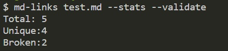
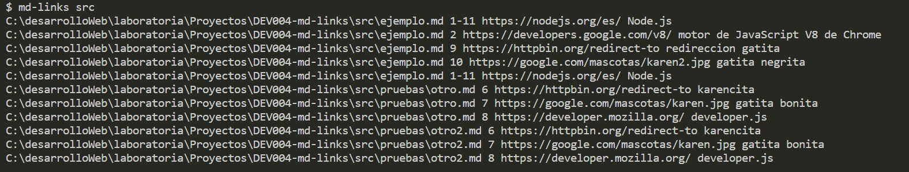

# Markdown Links

## Índice

* [1. Introducción](#1-introducción)
* [2. Resumen del proyecto](#2-resumen-del-proyecto)
* [3. Diagramas de Flujo del Proyecto](#3-diagramas-de-flujo-del-proyecto)
* [4. Planificación Github Project](#4-planificación-github-project)
* [5. Interfaz del CLI](#5-interfaz-del-cli)
* [6. Documentación tecnica de la libreria](#6-documentación-tecnica-de-la-libreria)
* [7. Test Unitario y Asincronos](#7-test-unitario-y-asincronos)
* [8. Guia de Instalación](#8-guia-de-instalación)
* [9. Checklist](#9-checklist)
* [10. Referencias](#10-referencias)

***

## 1. Introducción

En este proyecto se construyo una api para leer links de un archivo MD, y se uso la api desde un aplicación de terminal CLI para que nos de información adicional de cada link del archivo MD, la libreria esta disponible desde npm install.

## 2. Resumen del proyecto

En el primer Sprint se inicio con la primera versión del diagrama de flujo, en el segundo sprint se finalizo el diagrama de flujo y se realizo un caso ideal para usar la primera versión de la api desde el CLI, para usarlo sin options y con --stats mostrando la cantidad de link encontrados, en el 3er Sprint en el CLI se considera un segundo argumento options que puede tener el valor true o false, y en el CLI se considero --stats, --validate y --stats junto con --validate, en el 4to Sprint se considera la lectura de archivos de forma asincrona, información de la linea donde se encuentra el link encontrado en el archivo MD, se realizaron los test unitarios y se volvio modulo instalable con npm install

## 3. Diagramas de Flujo del Proyecto

Se realizaron dos diagramas de Flujo para el CLI y para la API para visualizar mejor lo que se tendría que hacer y planificar las tareas y objetivos.

- Diagrama de Flujo de la API

- Diagrama de Flujo del CLI

## 4. Planificación Github Project

- Sprint 1

- Sprint 2

- Sprint 3

- Sprint 4

- Github Project

## 5. Interfaz del CLI

- Usando md-links sin options

- Usando md-links con options --validate 

- Usando md-links con options --stats 

- Usando md-links con options --stats --validate 

- Usando md-links con ruta de directorio

## 6. Documentación tecnica de la libreria

### La libreria (API) se puede usar con el siguiente formato
#### `mdLinks(path, options)`

##### Argumentos

* `path`: Ruta **absoluta** o **relativa** al **archivo** o **directorio**.
Si la ruta pasada es relativa, se resuelve como relativa al directorio
desde donde se invoca node - _current working directory_).
* `options`: Un objeto con **únicamente** la siguiente propiedad:
  - `validate`: Booleano que determina si se desea validar los links
    encontrados.

##### Valor de retorno

La función  **retorna una promesa** (`Promise`) que **resuelve a un arreglo**
(`Array`) de objetos (`Object`), donde cada objeto representa un link y contiene
las siguientes propiedades

Con `validate:false` :

* `href`: URL encontrada.
* `text`: Texto que aparecía dentro del link (`<a>`).
* `file`: Ruta del archivo donde se encontró el link.
* `line`: Arreglo de lineas donde se encontró el link.

Con `validate:true` :

* `href`: URL encontrada.
* `text`: Texto que aparecía dentro del link (`<a>`).
* `file`: Ruta del archivo donde se encontró el link.
* `status`: Código de respuesta HTTP.
* `ok`: Mensaje `fail` en caso de fallo u `ok` en caso de éxito.
* `line`: Arreglo de lineas donde se encontró el link.

#### Ejemplo de resultados

- Usando mdLinks con validate false

- Usando mdLinks con validate true

## 7. Test Unitario y Asincronos

## 8. Guia de Instalación

### Para su intalación es necesario poner en la terminal

* npm install YesicaChui/DEV004-md-links 

***

## 9. Checklist

### General

* [ x ] Puede instalarse via `npm install --global <github-user>/md-links`

### `README.md`

* [ x ] Un board con el backlog para la implementación de la librería.
* [ x ] Documentación técnica de la librería.
* [ x ] Guía de instalación de la librería

### API `mdLinks(path, opts)`

* [ x ] El módulo exporta una función con la interfaz (API) esperada.
* [ x ] Implementa soporte para archivo individual
* [ x ] Implementa soporte para directorios
* [ x ] Implementa `options.validate`

### CLI

* [ x ] Expone ejecutable `md-links` en el path (configurado en `package.json`)
* [ x ] Se ejecuta sin errores / output esperado
* [ x ] Implementa `--validate`
* [ x ] Implementa `--stats`

### Pruebas / tests

* [ x ] Pruebas unitarias cubren un mínimo del 70% de statements, functions,
  lines, y branches.
* [ x ] Pasa tests (y linters) (`npm test`).

## 10. Referencias

* [Para convertir a md-link](https://medium.com/netscape/a-guide-to-create-a-nodejs-command-line-package-c2166ad0452e)
* [Para leeer argumentos con process]( https://nodejs.org/docs/latest/api/process.html#processargv)
* [Para usar marked]( https://dustinpfister.github.io/2017/11/19/nodejs-marked/)
* [Para usar jsom]( https://www.npmjs.com/package/jsdom?activeTab=readme)
* [Ejemplo de como usar process_cwd]( https://www.geeksforgeeks.org/difference-between-process-cwd-and-__dirname-in-node-js/)
* [Encuentre los índices de todas las Ocurrencias de Elemento en JS Array]( https://bobbyhadz.com/blog/javascript-find-index-all-occurrences-of-element-in-array)
* [Prueba de código asíncrono]( https://jestjs.io/docs/asynchronous)
